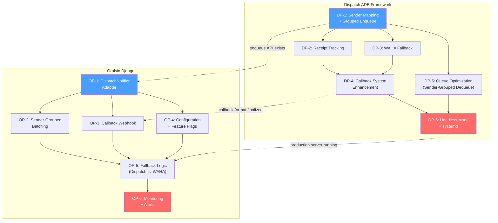
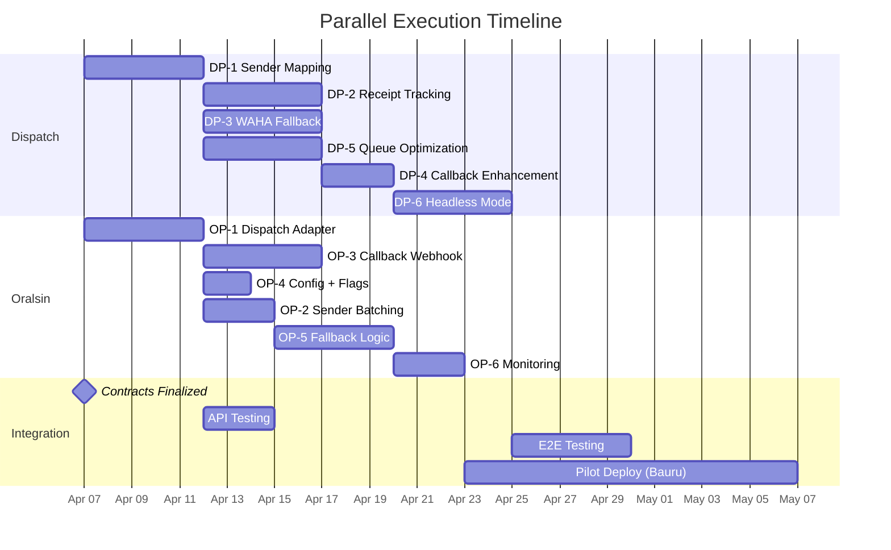

# Oralsin-Dispatch Integration: Dependency Graph

> **Date**: 2026-04-06
> **Purpose**: Clear visualization of all dependencies between Dispatch and Oralsin implementation phases.

---

## Full Dependency Graph



---

## Cross-Dependencies (Dispatch ↔ Oralsin)

| # | Dependency | Blocker | Unblocks | Notes |
|---|-----------|---------|----------|-------|
| 1 | DP-1 complete → OP-1 can start | Dispatch enqueue API must exist | Oralsin adapter can be tested against real API | OP-1 can start with mocked API while DP-1 is in progress |
| 2 | DP-4 complete → OP-3 can finalize | Callback JSON format must be finalized | Oralsin callback handler matches exact payload | OP-3 can start with contracts doc; finalize when DP-4 ships |
| 3 | DP-6 complete → OP-5 can deploy | Dispatch must be running in production | Oralsin can enable Dispatch routing for real clinics | OP-5 code can be written before DP-6, just not deployed |

---

## What Can Be Done in Parallel

### Fully Independent (no cross-dependency)



### Parallelism Matrix

| Phase Pair | Can Run in Parallel? | Reason |
|------------|---------------------|--------|
| DP-1 + OP-1 | YES | Both can start day 1. OP-1 mocks Dispatch API initially |
| DP-2 + DP-3 | YES | Both depend on DP-1 only, no shared state |
| DP-2 + DP-5 | YES | Independent concerns (receipts vs queue algorithm) |
| DP-3 + DP-5 | YES | Independent concerns (fallback vs dequeue) |
| OP-3 + OP-4 | YES | Both depend on OP-1 only, no shared state |
| OP-3 + OP-2 | YES | Callback and batching are independent |
| DP-1 + DP-2 | NO | DP-2 needs sender_number in messages table |
| DP-4 + DP-6 | NO | DP-6 needs all callbacks wired up |
| OP-5 + OP-6 | NO | Monitoring needs fallback logic deployed |

---

## Suggested Execution Order

### Strategy: Two Independent Tracks

**Track A (Dispatch)**: Build core capabilities in isolation, testable with curl/Postman.
**Track B (Oralsin)**: Build adapter in isolation, testable with mocked Dispatch API.
**Integration**: Connect when both tracks reach their integration point.

### Week-by-Week Plan

```
Week 1:
  Track A: DP-1 (Sender Mapping + Grouped Enqueue)
  Track B: OP-1 (DispatchNotifier Adapter) + OP-4 (Config)
  Shared:  Finalize integration-contracts.md

Week 2:
  Track A: DP-2 (Receipt Tracking) + DP-5 (Queue Optimization)
  Track B: OP-3 (Callback Webhook) + OP-2 (Sender Batching)
  Integration: Test OP-1 against real DP-1 API

Week 3:
  Track A: DP-3 (WAHA Fallback) + DP-4 (Callback Enhancement)
  Track B: OP-5 (Fallback Logic)
  Integration: Test callbacks end-to-end (DP-4 → OP-3)

Week 4:
  Track A: DP-6 (Headless Mode + systemd)
  Track B: OP-6 (Monitoring + Alerts)
  Integration: Deploy Dispatch to production server

Week 5-6:
  Pilot: Enable for Bauru clinic (22 pending, lowest volume)
  Monitor: Ban rates, delivery rates, callback latency
  Expand: Add Volta Redonda (39 pending) if metrics are good

Week 7-8:
  Full rollout: All 4 clinics
  WAHA becomes backup-only (fallback for ADB failures)
```

---

## Critical Path Analysis

The critical path determines the minimum time to production:

```
DP-1 (5d) → DP-2 (5d) → DP-4 (3d) → DP-6 (5d) = 18 working days (Dispatch)
OP-1 (5d) → OP-2 (3d) → OP-5 (5d) → OP-6 (3d) = 16 working days (Oralsin)
```

**Dispatch is the bottleneck at 18 days.** Oralsin finishes 2 days earlier.

Adding pilot time: 18 days + 10 days pilot = **28 working days (~6 weeks) to production**.

---

## Risk Mitigation

| Risk | Impact | Mitigation |
|------|--------|------------|
| Dispatch server not ready for pilot | Blocks OP-5 deployment | OP-5 code is ready, just needs DISPATCH_ENABLED=true |
| Callback format changes after OP-3 written | Rework callback handler | Finalize contracts doc in Week 1, use as source of truth |
| ADB ban rate higher than expected | Reduced throughput | WAHA fallback (DP-3) handles gracefully |
| Dispatch server crashes in production | Messages stuck in queue | DISPATCH_FALLBACK_TO_WAHA=true routes to WAHA automatically |
| HMAC secret mismatch | All callbacks rejected | Test with curl before enabling pilot |

---

## Rollback Points

Each phase has an independent rollback strategy. The global rollback is:

```
1. Set DISPATCH_ENABLED=false in Oralsin .env
2. Restart Temporal workers
3. All WhatsApp traffic immediately reverts to WAHA
4. No data loss — ContactHistory populated regardless of provider
5. Dispatch server can stay running (no harm, just idle)
```
