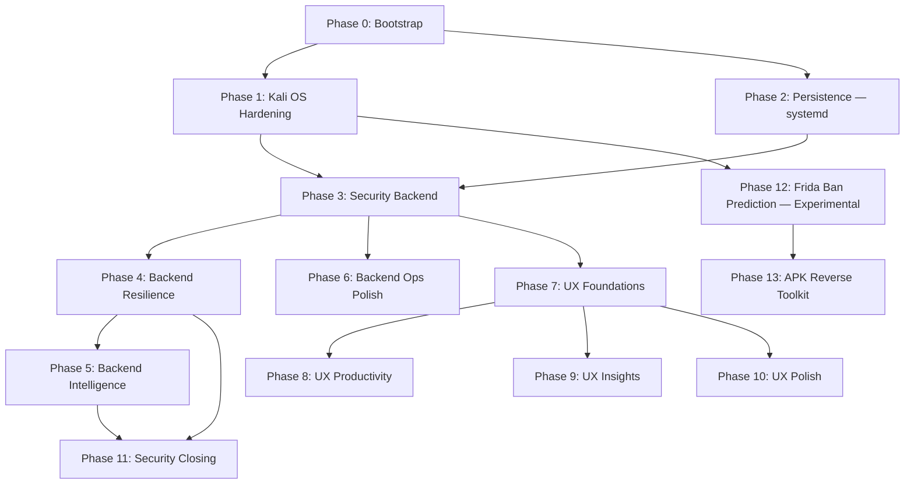

# Dispatch Platform Overhaul Implementation Plan

> **For agentic workers:** REQUIRED SUB-SKILL: Use `superpowers:subagent-driven-development` (recommended) or `superpowers:executing-plans` to implement this plan task-by-task. Steps use checkbox (`- [ ]`) syntax for tracking.

**Goal:** Endurecer Dispatch (servidor físico Kali, exposto via Tailscale Funnel) em 4 frentes — sistema operacional (Kali), backend, UI/UX e segurança — totalizando **47 features** organizadas em 13 fases com dependências explícitas.

**Architecture:** Cada fase é executada via SSH direto no Kali (`ssh adb@dispatch`). Mudanças de código são feitas localmente, commitadas, pushed pro GitHub, depois `git pull` no Kali, build, restart, smoke-test. Mudanças de infra (systemd, fail2ban, etc) são aplicadas direto no Kali via SSH com sudoers cirúrgico já configurado.

**Tech Stack:** Node.js 22 + TypeScript + Fastify (backend), React 19 + Vite + Tailwind v4 (UI), SQLite (better-sqlite3), Caddy reverse proxy, Tailscale Funnel, Kali Linux 6.19.

---

## 🔌 Session Bootstrap (executar SEMPRE no início — sessão começa limpa de contexto)

> **CRITICAL**: Esta seção é mandatória. Sem ela você não tem contexto suficiente pra executar o plano.

### Step 0.1: Recuperar memória do projeto

Read these files first:

- `/home/ti/.claude/projects/-var-www-adb-tools/memory/MEMORY.md` (índice de memórias)
- `/home/ti/.claude/projects/-var-www-adb-tools/memory/project_physical_server_setup.md` (estado da Kali — topologia, serviços, segurança aplicada)
- `/var/www/adb_tools/CLAUDE.md` (protocolo de desenvolvimento — fases, test phone, conventions)
- `/var/www/adb_tools/docs/PRD-dispatch.md` (PRD completo)

### Step 0.2: Verificar acesso SSH ao Kali

```bash
ssh -o ConnectTimeout=5 -o StrictHostKeyChecking=accept-new adb@dispatch "echo OK; hostname; uname -r; whoami"
```

**Expected output:**
```
OK
debt-adbkali
6.19.11+kali-amd64
adb
```

Se falhar com "tailnet policy does not permit you to SSH": ACL no admin Tailscale precisa do bloco `ssh: { src=autogroup:member, dst=autogroup:self, users=[adb,root] }`. Já configurado em sessões anteriores. Se realmente sumiu, edite em `https://login.tailscale.com/admin/acls/file`.

### Step 0.3: Confirmar SSH alternativo

```bash
ssh adb@100.77.249.93 "echo IP_OK"
tailscale status | head -5
```

### Step 0.4: Estado do servidor (snapshot inicial)

```bash
ssh adb@dispatch '
echo "=== Services ==="
for svc in caddy ssh tailscaled pipeboard-tunnel; do
  printf "  %-20s %s\n" "$svc" "$(systemctl is-active $svc 2>/dev/null)"
done
echo
echo "=== Ports ==="
ss -ltnp 2>/dev/null | awk "\$4 ~ /:(7890|5174|8080|25432)/ { print \$4 }"
echo
echo "=== Funnel ==="
tailscale funnel status 2>/dev/null | grep -E "https|proxy"
echo
echo "=== Repo HEAD ==="
cd /var/www/debt-adb-framework && git log --oneline -3
echo
echo "=== Devices ==="
sqlite3 /var/www/debt-adb-framework/packages/core/dispatch.db "SELECT serial, status, model FROM devices;"
echo
echo "=== Disk + RAM ==="
df -h /var/www | tail -1
free -h | head -2
'
```

**Expected:** todos os 4 serviços `active`, 4 portas escutando, Funnel `(Funnel on)`, repo HEAD em `54c8b765` ou superior, 2 devices online.

### Step 0.5: Constantes deste plano (anotar mentalmente)

```
SSH_HOST            = adb@dispatch         (alias preferido — MagicDNS)
SSH_HOST_IP         = adb@100.77.249.93
KALI_REPO_PATH      = /var/www/debt-adb-framework
LOCAL_REPO_PATH     = /var/www/adb_tools
PUBLIC_URL          = https://dispatch.tail106aa2.ts.net
LOGIN_USERNAME      = debt
LOGIN_PASSWORD      = (consultar .env do Kali ou password manager do Daniel)
TEST_PHONE_NUMBER   = 5543991938235
KALI_SUDOERS        = /etc/sudoers.d/dispatch-ops (NOPASSWD cirúrgico já configurado)
PIPEBOARD_TUNNEL    = localhost:25432 → 188.245.66.92:15432 (systemd: pipeboard-tunnel.service)
ENV_FILE            = /var/www/debt-adb-framework/packages/core/.env (perms 600, owner adb)
TMUX_SESSION        = dispatch (criada por make up-prod)
```

### Step 0.6: Branch strategy

Trabalhe na `main`. Cada fase resulta em ≥ 1 commit pushed. Pull no Kali entre cada fase. Se uma fase quebrar, rollback é `git revert <sha>` + redeploy. NÃO crie branch separada — perde sincronia entre worktree local e Kali.

### Step 0.7: Workflow padrão de cada feature

```
1. Edita código em /var/www/adb_tools (LOCAL_REPO_PATH)
2. pnpm --filter @dispatch/core build  (ou ui)
3. pnpm test (filtrado pra arquivo modificado)
4. git add ... && git commit -m "..." && git push origin main
5. ssh adb@dispatch 'cd /var/www/debt-adb-framework && git pull --ff-only && pnpm --filter @dispatch/<pkg> build'
6. (Se for runtime) restart via systemd ou make down && make up-prod
7. Smoke test via SSH (curl direto do Kali OU via Funnel pública)
```

---

## 📊 Execution Graph (Mermaid)



### Critical Path

`P0 → P1+P2 → P3 → P4 → P5 → P11`

### Parallel Tracks

- **Ops** (P1, P2, P6) — pode rodar paralelo com Sec/UX se time tiver capacidade.
- **UX** (P7, P8, P9, P10) — pode rodar paralelo a Backend (P4-P6) **depois** de P3.
- **Experimental** (P12, P13) — totalmente paralelo, não bloqueia produção.

### Estimativa total

| Fase | Esforço | Dependências |
|---|---|---|
| P0 Bootstrap | 30 min | — |
| P1 Kali OS Hardening | 4h | P0 |
| P2 Persistence (systemd core) | 2h | P0 |
| P3 Security Backend | 6h | P1, P2 |
| P4 Backend Resilience | 10h | P3 |
| P5 Backend Intelligence | 22h | P4 |
| P6 Backend Ops Polish | 14h | P3 |
| P7 UX Foundations | 13h | P3 |
| P8 UX Productivity | 18h | P7 |
| P9 UX Insights | 14h | P7 |
| P10 UX Polish | 16h | P7 |
| P11 Security Closing | 12h | P4, P5 |
| P12 Frida Ban Prediction | 8h | P1 |
| P13 APK Reverse Toolkit | 4h | P12 |
| **TOTAL** | **~143h** | |

---

# Phase 1 — Kali OS Hardening

> **Deps:** P0 done. Roda 100% via SSH no Kali, sem mudanças de código.

## Task 1.1 (K-fail2ban) — fail2ban contra brute-force SSH e /api/v1/auth/login

**Files:**
- Create on Kali: `/etc/fail2ban/jail.d/dispatch-ssh.conf`
- Create on Kali: `/etc/fail2ban/jail.d/dispatch-login.conf`
- Create on Kali: `/etc/fail2ban/filter.d/dispatch-login.conf`

- [ ] **Step 1.1.1: Instalar fail2ban no Kali**

```bash
ssh adb@dispatch 'sudo apt install -y fail2ban && systemctl is-active fail2ban'
```

Expected: `active`

- [ ] **Step 1.1.2: Jail SSH**

```bash
ssh adb@dispatch 'sudo tee /etc/fail2ban/jail.d/dispatch-ssh.conf > /dev/null <<EOF
[sshd]
enabled = true
port = ssh
filter = sshd
logpath = %(sshd_log)s
backend = systemd
maxretry = 3
findtime = 600
bantime = 3600
EOF'
```

- [ ] **Step 1.1.3: Filter customizado para /api/v1/auth/login (Caddy access log)**

```bash
ssh adb@dispatch 'sudo tee /etc/fail2ban/filter.d/dispatch-login.conf > /dev/null <<EOF
[Definition]
failregex = ^.*"remote_ip":"<HOST>".*"method":"POST".*"uri":"/api/v1/auth/login".*"status":401.*$
ignoreregex =
EOF'
```

- [ ] **Step 1.1.4: Jail Caddy**

```bash
ssh adb@dispatch 'sudo tee /etc/fail2ban/jail.d/dispatch-login.conf > /dev/null <<EOF
[dispatch-login]
enabled = true
filter = dispatch-login
backend = systemd
journalmatch = _SYSTEMD_UNIT=caddy.service
maxretry = 5
findtime = 300
bantime = 1800
action = iptables-multiport[name=dispatch-login, port="https,http,8080", protocol=tcp]
EOF'
```

- [ ] **Step 1.1.5: Reload + verificar**

```bash
ssh adb@dispatch 'sudo systemctl reload fail2ban && sleep 2 && sudo fail2ban-client status'
```

- [ ] **Step 1.1.6: Test — gerar 6 tentativas falhas e verificar ban**

```bash
ssh adb@dispatch '
for i in $(seq 1 6); do
  curl -sS -o /dev/null -w "%{http_code} " -X POST \
    -H "Content-Type: application/json" \
    -d "{\"username\":\"debt\",\"password\":\"WRONG_$i\"}" \
    https://dispatch.tail106aa2.ts.net/api/v1/auth/login
done
echo
sleep 5
sudo fail2ban-client status dispatch-login
'
```

- [ ] **Step 1.1.7: Limpar ban de teste**

```bash
ssh adb@dispatch 'sudo fail2ban-client unban --all'
```

- [ ] **Step 1.1.8: Atualizar `infra/bootstrap-secure.sh` + commit**

Adicionar bloco `[6/N] fail2ban` ao bootstrap script com mesmo conteúdo dos passos 1.1.2-1.1.4.

```bash
git add infra/bootstrap-secure.sh
git commit -m "feat(infra): fail2ban for SSH + login bruteforce protection"
git push origin main
```

---

## Task 1.2 (K-unattended) — unattended-upgrades

- [ ] **Step 1.2.1: Instalar**

```bash
ssh adb@dispatch 'sudo apt install -y unattended-upgrades apt-listchanges'
```

- [ ] **Step 1.2.2: Habilitar non-interactive**

```bash
ssh adb@dispatch 'echo "unattended-upgrades unattended-upgrades/enable_auto_updates boolean true" | sudo debconf-set-selections && sudo dpkg-reconfigure -f noninteractive unattended-upgrades'
```

- [ ] **Step 1.2.3: Configurar Kali sources**

```bash
ssh adb@dispatch 'sudo tee /etc/apt/apt.conf.d/52unattended-upgrades-kali > /dev/null <<EOF
Unattended-Upgrade::Origins-Pattern {
    "origin=Debian,codename=\${distro_codename},label=Debian";
    "origin=Debian,codename=\${distro_codename},label=Debian-Security";
    "origin=Kali,codename=kali-rolling";
};
Unattended-Upgrade::Package-Blacklist {
    "openssh-server";
    "fail2ban";
};
Unattended-Upgrade::Remove-Unused-Kernel-Packages "true";
Unattended-Upgrade::Remove-Unused-Dependencies "true";
Unattended-Upgrade::Automatic-Reboot "false";
EOF'
```

- [ ] **Step 1.2.4: Dry-run**

```bash
ssh adb@dispatch 'sudo unattended-upgrade --dry-run --debug 2>&1 | tail -30'
```

Expected: `Allowed origins are:` listando Debian e Kali.

- [ ] **Step 1.2.5: Verificar timer**

```bash
ssh adb@dispatch 'systemctl status apt-daily-upgrade.timer --no-pager | head -8'
```

- [ ] **Step 1.2.6: Commit no bootstrap**

```bash
git commit -am "feat(infra): unattended-upgrades for Kali security patches"
git push origin main
```

---

## Task 1.3 (K-aide) — AIDE tripwire de filesystem

- [ ] **Step 1.3.1: Instalar**

```bash
ssh adb@dispatch 'sudo apt install -y aide aide-common'
```

- [ ] **Step 1.3.2: Config — só monitorar paths críticos do Dispatch**

```bash
ssh adb@dispatch 'sudo tee /etc/aide/aide.conf.d/99_dispatch > /dev/null <<EOF
/etc/sudoers.d/dispatch-ops f+p+u+g+s+m+c+md5+sha256
/etc/systemd/system/pipeboard-tunnel.service f+p+u+g+s+m+c+md5+sha256
/etc/ssh/sshd_config.d/10-dispatch-hardening.conf f+p+u+g+s+m+c+md5+sha256
/etc/caddy/Caddyfile f+p+u+g+s+m+c+md5+sha256
/var/www/debt-adb-framework/packages/core/.env f+p+u+g+s+m+c+md5+sha256
EOF'
```

- [ ] **Step 1.3.3: Inicializar baseline**

```bash
ssh adb@dispatch 'sudo aideinit -y -f 2>&1 | tail -10'
```

- [ ] **Step 1.3.4: Mover baseline para ativo**

```bash
ssh adb@dispatch 'sudo mv /var/lib/aide/aide.db.new /var/lib/aide/aide.db && sudo aide --check 2>&1 | tail -5'
```

Expected: `AIDE found NO differences ... Looks okay!!`

- [ ] **Step 1.3.5: Cron diário**

```bash
ssh adb@dispatch 'sudo tee /etc/cron.daily/dispatch-aide-check > /dev/null <<EOF
#!/bin/bash
OUT=\$(/usr/bin/aide --check 2>&1)
if echo "\$OUT" | grep -q "found differences"; then
  echo "\$OUT" | logger -t dispatch-aide -p auth.warn
fi
EOF
sudo chmod +x /etc/cron.daily/dispatch-aide-check'
```

- [ ] **Step 1.3.6: Test — modificar arquivo monitorado e verificar detecção**

```bash
ssh adb@dispatch '
echo "# test comment" | sudo tee -a /etc/sudoers.d/dispatch-ops > /dev/null
sudo aide --check 2>&1 | grep -A2 "dispatch-ops" | head -10
sudo sed -i "/# test comment/d" /etc/sudoers.d/dispatch-ops
sudo aideinit -y -f && sudo mv /var/lib/aide/aide.db.new /var/lib/aide/aide.db
'
```

- [ ] **Step 1.3.7: Commit**

```bash
git commit -am "feat(infra): AIDE tripwire on dispatch-critical files"
git push origin main
```

---

## Task 1.4 (K-auditd) — auditd para syscalls em arquivos sensíveis

- [ ] **Step 1.4.1: Instalar**

```bash
ssh adb@dispatch 'sudo apt install -y auditd audispd-plugins'
```

- [ ] **Step 1.4.2: Regras**

```bash
ssh adb@dispatch 'sudo tee /etc/audit/rules.d/dispatch.rules > /dev/null <<EOF
-w /var/www/debt-adb-framework/packages/core/.env -p ra -k dispatch_env
-w /etc/sudoers.d/dispatch-ops -p wa -k dispatch_sudoers
-w /etc/systemd/system/pipeboard-tunnel.service -p wa -k dispatch_pipeboard_unit
EOF
sudo augenrules --load
sudo systemctl restart auditd
sudo auditctl -l
'
```

- [ ] **Step 1.4.3: Test**

```bash
ssh adb@dispatch '
cat /var/www/debt-adb-framework/packages/core/.env > /dev/null
sudo ausearch -k dispatch_env -ts recent 2>&1 | tail -10
'
```

- [ ] **Step 1.4.4: Cron diário pra alertas**

```bash
ssh adb@dispatch 'sudo tee /etc/cron.daily/dispatch-audit-summary > /dev/null <<EOF
#!/bin/bash
SINCE=\$(date -d yesterday "+%Y-%m-%d %H:%M:%S")
ALERTS=\$(/sbin/ausearch -k dispatch_env -ts "\$SINCE" 2>/dev/null | grep -E "comm=" | grep -v "comm=\\"node\\"" | head -10)
if [ -n "\$ALERTS" ]; then
  echo "\$ALERTS" | logger -t dispatch-audit -p auth.warn
fi
EOF
sudo chmod +x /etc/cron.daily/dispatch-audit-summary'
```

- [ ] **Step 1.4.5: Commit**

```bash
git commit -am "feat(infra): auditd rules on .env and dispatch sudoers/systemd"
git push origin main
```

---

## Task 1.5 (K-restic) — Backup encriptado diário do dispatch.db

- [ ] **Step 1.5.1: Instalar**

```bash
ssh adb@dispatch 'sudo apt install -y restic && restic version'
```

- [ ] **Step 1.5.2: Criar destino**

```bash
ssh adb@dispatch 'sudo mkdir -p /var/backups/dispatch-restic && sudo chown adb:adb /var/backups/dispatch-restic'
```

- [ ] **Step 1.5.3: Inicializar repositório (anotar passphrase no password manager)**

```bash
ssh adb@dispatch '
RESTIC_PWD=$(openssl rand -base64 32)
echo "$RESTIC_PWD" > /home/adb/.restic-password
chmod 600 /home/adb/.restic-password
echo "PASSPHRASE: $RESTIC_PWD"
restic init -r /var/backups/dispatch-restic --password-file /home/adb/.restic-password
'
```

- [ ] **Step 1.5.4: Snapshot manual + verify**

```bash
ssh adb@dispatch '
sqlite3 /var/www/debt-adb-framework/packages/core/dispatch.db ".backup /tmp/dispatch.db.snapshot"
restic -r /var/backups/dispatch-restic --password-file /home/adb/.restic-password backup /tmp/dispatch.db.snapshot --tag manual
restic -r /var/backups/dispatch-restic --password-file /home/adb/.restic-password snapshots
restic -r /var/backups/dispatch-restic --password-file /home/adb/.restic-password check
rm /tmp/dispatch.db.snapshot
'
```

- [ ] **Step 1.5.5: Cron + script**

```bash
ssh adb@dispatch 'sudo tee /etc/cron.d/dispatch-restic-backup > /dev/null <<EOF
0 3 * * * adb /usr/local/bin/dispatch-backup.sh >>/var/log/dispatch-backup.log 2>&1
EOF

sudo tee /usr/local/bin/dispatch-backup.sh > /dev/null <<SCRIPT_EOF
#!/bin/bash
set -euo pipefail
REPO=/var/backups/dispatch-restic
PASS=/home/adb/.restic-password
SRC=/var/www/debt-adb-framework/packages/core/dispatch.db
SNAP=/tmp/dispatch.db.snapshot.\$\$
trap "rm -f \$SNAP" EXIT
sqlite3 "\$SRC" ".backup \$SNAP"
restic -r "\$REPO" --password-file "\$PASS" backup "\$SNAP" --tag cron --tag "\$(date +%Y%m%d)"
restic -r "\$REPO" --password-file "\$PASS" forget --tag cron --keep-daily 7 --keep-weekly 4 --keep-monthly 6 --prune
SCRIPT_EOF

sudo chmod 755 /usr/local/bin/dispatch-backup.sh
sudo touch /var/log/dispatch-backup.log
sudo chown adb:adb /var/log/dispatch-backup.log
'
```

- [ ] **Step 1.5.6: Test cron script**

```bash
ssh adb@dispatch '/usr/local/bin/dispatch-backup.sh && tail -5 /var/log/dispatch-backup.log'
```

- [ ] **Step 1.5.7: Commit + bootstrap update**

```bash
git commit -am "feat(infra): restic encrypted daily backup of dispatch.db"
git push origin main
```

---

## Task 1.6 (K-pcap) — On-demand tcpdump/wireshark capture

**Files:**
- Versionar: `/var/www/adb_tools/infra/scripts/dispatch-pcap.sh`
- Deploy: `/usr/local/bin/dispatch-pcap` no Kali

- [ ] **Step 1.6.1: Confirmar tcpdump (pre-instalado no Kali)**

```bash
ssh adb@dispatch 'which tcpdump && tcpdump --version | head -1'
```

- [ ] **Step 1.6.2: Criar script**

```bash
mkdir -p /var/www/adb_tools/infra/scripts
cat > /var/www/adb_tools/infra/scripts/dispatch-pcap.sh <<'PCAP_EOF'
#!/bin/bash
# Captura tráfego do Dispatch on-demand. Uso:
#   dispatch-pcap waha 60     # 60s WAHA (host gows-chat.debt.com.br + porta 3000)
#   dispatch-pcap adb 30      # 30s ADB (porta 5037 + 5555 + 5556)
#   dispatch-pcap core 120    # 120s do core local (porta 7890 + 8080)
set -euo pipefail
TARGET=${1:-core}
DURATION=${2:-30}
OUT="/var/log/dispatch-pcap/${TARGET}-$(date +%Y%m%d-%H%M%S).pcap"
mkdir -p /var/log/dispatch-pcap
case "$TARGET" in
  waha) FILTER="host gows-chat.debt.com.br or port 3000" ;;
  adb)  FILTER="port 5037 or port 5555 or port 5556" ;;
  core) FILTER="port 7890 or port 8080" ;;
  ts)   FILTER="port 41641 or udp port 3478" ;;
  *)    echo "Unknown target: $TARGET (use waha|adb|core|ts)"; exit 1 ;;
esac
echo "Capturing $TARGET ($FILTER) for ${DURATION}s -> $OUT"
sudo timeout "$DURATION" tcpdump -i any -w "$OUT" -s 0 -nn "$FILTER" 2>&1 | tail -3
echo "Saved: $OUT (size: $(du -h "$OUT" | cut -f1))"
echo "Inspect with: wireshark $OUT  OR  tcpdump -r $OUT -nn -A"
PCAP_EOF
chmod +x /var/www/adb_tools/infra/scripts/dispatch-pcap.sh
```

- [ ] **Step 1.6.3: Deploy no Kali**

```bash
scp /var/www/adb_tools/infra/scripts/dispatch-pcap.sh adb@dispatch:/tmp/
ssh adb@dispatch 'sudo install -m 755 /tmp/dispatch-pcap.sh /usr/local/bin/dispatch-pcap'
```

- [ ] **Step 1.6.4: NOPASSWD para tcpdump**

```bash
ssh adb@dispatch 'sudo tee -a /etc/sudoers.d/dispatch-ops > /dev/null <<EOF
adb ALL=(root) NOPASSWD: /usr/bin/timeout * /usr/bin/tcpdump *
EOF
sudo visudo -cf /etc/sudoers.d/dispatch-ops'
```

- [ ] **Step 1.6.5: Test (5s)**

```bash
ssh adb@dispatch 'dispatch-pcap core 5 && ls -la /var/log/dispatch-pcap/'
```

- [ ] **Step 1.6.6: Commit**

```bash
git add infra/scripts/dispatch-pcap.sh
git commit -m "feat(infra): on-demand pcap capture script (waha/adb/core/ts)"
git push origin main
```

---

## Task 1.7 (K-mitmproxy) — mitmproxy interceptor

- [ ] **Step 1.7.1: Confirmar instalado**

```bash
ssh adb@dispatch 'which mitmproxy mitmdump mitmweb || sudo apt install -y mitmproxy'
```

- [ ] **Step 1.7.2: Criar wrapper**

```bash
cat > /var/www/adb_tools/infra/scripts/dispatch-mitm.sh <<'MITM_EOF'
#!/bin/bash
# Roda mitmweb interceptando HTTPS WAHA upstream.
# Uso: dispatch-mitm [PROXY_PORT=8888] [WEB_PORT=8081]
PORT=${1:-8888}
WEB_PORT=${2:-8081}
LISTEN=$(tailscale ip -4 | head -1)
echo "mitmweb on http://$LISTEN:$WEB_PORT (proxy port $PORT)"
echo "Cert em ~/.mitmproxy/mitmproxy-ca-cert.pem (instale no cliente test)"
exec mitmweb --listen-host "$LISTEN" --listen-port "$PORT" --web-host "$LISTEN" --web-port "$WEB_PORT" --no-web-open-browser --set "block_global=false"
MITM_EOF
chmod +x /var/www/adb_tools/infra/scripts/dispatch-mitm.sh
```

- [ ] **Step 1.7.3: Deploy**

```bash
scp /var/www/adb_tools/infra/scripts/dispatch-mitm.sh adb@dispatch:/tmp/
ssh adb@dispatch 'sudo install -m 755 /tmp/dispatch-mitm.sh /usr/local/bin/dispatch-mitm'
```

- [ ] **Step 1.7.4: Documentar uso em `infra/README.md`** — seção "Operational Tools".

- [ ] **Step 1.7.5: Commit**

```bash
git add infra/scripts/dispatch-mitm.sh infra/README.md
git commit -m "feat(infra): mitmproxy on-demand interceptor for WAHA debugging"
git push origin main
```

---

# Phase 2 — Persistence: systemd unit for core

> **Deps:** P0. **Substitui o tmux como única forma de rodar o core em produção.**

## Task 2.1 (B5) — systemd unit `dispatch-core.service`

**Files:**
- Versionar: `/var/www/adb_tools/infra/dispatch-core.service`
- Deploy: `/etc/systemd/system/dispatch-core.service`
- Modify: `infra/bootstrap-secure.sh` (instalar unit)
- Modify: `Makefile` (targets `core-up/down/restart/logs/status`)

- [ ] **Step 2.1.1: Criar unit file no repo**

```bash
cat > /var/www/adb_tools/infra/dispatch-core.service <<'UNIT_EOF'
[Unit]
Description=Dispatch Core (Fastify API + Engine)
Documentation=https://github.com/MrSchrodingers/debt-adb-framework
After=network-online.target tailscaled.service pipeboard-tunnel.service
Wants=network-online.target pipeboard-tunnel.service

[Service]
Type=simple
User=adb
WorkingDirectory=/var/www/debt-adb-framework/packages/core
EnvironmentFile=/var/www/debt-adb-framework/packages/core/.env
Environment=NODE_ENV=production
Environment=NVM_DIR=/home/adb/.nvm
Environment=PATH=/home/adb/.nvm/versions/node/v22.22.2/bin:/usr/local/sbin:/usr/local/bin:/usr/sbin:/usr/bin:/sbin:/bin

ExecStartPre=/bin/bash -c 'test -f /var/www/debt-adb-framework/packages/core/dist/main.js'
ExecStart=/home/adb/.nvm/versions/node/v22.22.2/bin/node dist/main.js

Restart=always
RestartSec=5
StartLimitInterval=300
StartLimitBurst=10

NoNewPrivileges=true
ProtectSystem=strict
ReadWritePaths=/var/www/debt-adb-framework/packages/core
ProtectHome=read-only
PrivateTmp=true
ProtectKernelTunables=true
ProtectKernelModules=true
ProtectControlGroups=true

LimitNOFILE=65536
MemoryHigh=1G
MemoryMax=2G

StandardOutput=journal
StandardError=journal
SyslogIdentifier=dispatch-core

[Install]
WantedBy=multi-user.target
UNIT_EOF
```

- [ ] **Step 2.1.2: Build core no Kali (precisa de dist/)**

```bash
ssh adb@dispatch 'cd /var/www/debt-adb-framework && export NVM_DIR="$HOME/.nvm" && . "$NVM_DIR/nvm.sh" && nvm use default && pnpm --filter @dispatch/core build && ls -la packages/core/dist/main.js'
```

- [ ] **Step 2.1.3: Deploy unit**

```bash
scp /var/www/adb_tools/infra/dispatch-core.service adb@dispatch:/tmp/
ssh adb@dispatch 'sudo install -m 644 /tmp/dispatch-core.service /etc/systemd/system/dispatch-core.service && sudo systemctl daemon-reload'
```

- [ ] **Step 2.1.4: Migrar — matar tmux, subir systemd**

```bash
ssh adb@dispatch '
make -C /var/www/debt-adb-framework down 2>&1 | tail -3
sleep 3
sudo systemctl enable --now dispatch-core
sleep 5
systemctl is-active dispatch-core
ss -ltnp | grep :7890
'
```

- [ ] **Step 2.1.5: Smoke test**

```bash
ssh adb@dispatch 'curl -sS http://127.0.0.1:7890/healthz && echo'
```

- [ ] **Step 2.1.6: Test crash recovery**

```bash
ssh adb@dispatch '
PID=$(systemctl show -p MainPID --value dispatch-core)
echo "Killing PID $PID..."
sudo kill -9 $PID
sleep 7
NEW_PID=$(systemctl show -p MainPID --value dispatch-core)
echo "New PID: $NEW_PID"
[ "$PID" != "$NEW_PID" ] && echo "respawn OK" || echo "FAIL"
'
```

Expected: `respawn OK`.

- [ ] **Step 2.1.7: Atualizar Makefile**

Adicionar seção `##@ Core (systemd)` ao `Makefile` com targets `core-up`, `core-down`, `core-restart`, `core-logs`, `core-status`.

- [ ] **Step 2.1.8: NOPASSWD sudoers**

```bash
ssh adb@dispatch 'sudo tee -a /etc/sudoers.d/dispatch-ops > /dev/null <<EOF
adb ALL=(root) NOPASSWD: /bin/systemctl restart dispatch-core.service
adb ALL=(root) NOPASSWD: /bin/systemctl start dispatch-core.service
adb ALL=(root) NOPASSWD: /bin/systemctl stop dispatch-core.service
adb ALL=(root) NOPASSWD: /bin/systemctl status dispatch-core.service
adb ALL=(root) NOPASSWD: /bin/journalctl -u dispatch-core *
EOF
sudo visudo -cf /etc/sudoers.d/dispatch-ops'
```

- [ ] **Step 2.1.9: Test `make core-restart` do laptop**

```bash
make -C /var/www/adb_tools core-restart && make -C /var/www/adb_tools core-status
```

- [ ] **Step 2.1.10: Atualizar bootstrap + README**

- [ ] **Step 2.1.11: Commit**

```bash
git add infra/dispatch-core.service infra/bootstrap-secure.sh infra/README.md Makefile
git commit -m "feat(infra): systemd unit for dispatch-core (replace tmux in prod)"
git push origin main
```

---

# Phase 3 — Security Backend

> **Deps:** P1, P2. Ordem: 3.1 (bcrypt) → 3.2 (HMAC outbound) → 3.3 (Bearer-only UI) → 3.4 (refresh tokens).

## Task 3.1 (B1) — bcrypt password hash

**Files:**
- Modify: `packages/core/src/api/auth-login.ts`
- Create: `packages/core/src/api/password-hash.ts`
- Create: `packages/core/src/api/password-hash.test.ts`
- Create: `scripts/hash-password.ts`

- [ ] **Step 3.1.1: Add deps**

```bash
pnpm --filter @dispatch/core add bcryptjs && pnpm --filter @dispatch/core add -D @types/bcryptjs
```

- [ ] **Step 3.1.2: Test red — `password-hash.test.ts`**

Cobre: `hashPassword`, `verifyPassword`, `isPasswordHashed`, plaintext fallback.

- [ ] **Step 3.1.3: Run failing**

```bash
pnpm --filter @dispatch/core test -- password-hash 2>&1 | tail -15
```

- [ ] **Step 3.1.4: Implementar**

```typescript
// packages/core/src/api/password-hash.ts
import { compare, hash } from 'bcryptjs'
import { timingSafeEqual } from 'node:crypto'
const BCRYPT_ROUNDS = 12
const BCRYPT_RE = /^\$2[aby]\$/
export function isPasswordHashed(stored: string): boolean { return BCRYPT_RE.test(stored) }
export async function hashPassword(plain: string): Promise<string> { return hash(plain, BCRYPT_ROUNDS) }
export async function verifyPassword(plain: string, stored: string): Promise<boolean> {
  if (isPasswordHashed(stored)) return compare(plain, stored)
  if (plain.length !== stored.length) {
    timingSafeEqual(Buffer.from('x'.repeat(64)), Buffer.from('y'.repeat(64)))
    return false
  }
  return timingSafeEqual(Buffer.from(plain), Buffer.from(stored))
}
```

- [ ] **Step 3.1.5: Run green**

- [ ] **Step 3.1.6: Modificar `auth-login.ts` para usar `verifyPassword`**

- [ ] **Step 3.1.7: Build + run all auth tests**

- [ ] **Step 3.1.8: CLI util `scripts/hash-password.ts`**

- [ ] **Step 3.1.9: No Kali — gerar hash da senha atual e atualizar .env**

```bash
ssh adb@dispatch '
cd /var/www/debt-adb-framework
git pull --ff-only origin main
export NVM_DIR="$HOME/.nvm" && . "$NVM_DIR/nvm.sh" && nvm use default
pnpm install --frozen-lockfile
pnpm --filter @dispatch/core build
PLAIN=$(grep ^DISPATCH_AUTH_PASSWORD packages/core/.env | cut -d= -f2-)
HASH=$(npx tsx scripts/hash-password.ts "$PLAIN")
cp -p packages/core/.env packages/core/.env.bak.$(date +%Y%m%d-%H%M%S)
sed -i "s|^DISPATCH_AUTH_PASSWORD=.*|DISPATCH_AUTH_PASSWORD=$HASH|" packages/core/.env
'
```

- [ ] **Step 3.1.10: Restart core + smoke**

```bash
make -C /var/www/adb_tools core-restart
```

Browser: login com mesma senha plaintext deve funcionar (porque o backend agora detecta hash e usa `compare`).

- [ ] **Step 3.1.11: Commit**

```bash
git commit -am "feat(auth): bcrypt password hashing with plaintext fallback for migration"
git push origin main
```

---

## Task 3.2 (B16) — HMAC signing on outbound callbacks

**Files:**
- Modify: `packages/core/src/plugins/callback-delivery.ts`
- Modify: `packages/core/src/plugins/callback-delivery.test.ts`

- [ ] **Step 3.2.1: Test red — verificar header `X-Dispatch-Signature` é incluído**

```typescript
it('signs outbound callback body with HMAC-SHA256 when hmacSecret is set', async () => {
  // mock fetch, deliver, assert header X-Dispatch-Signature == sha256=hex(HMAC(body))
})
it('omits X-Dispatch-Signature when no hmacSecret configured', async () => { /* ... */ })
```

- [ ] **Step 3.2.2: Implementar — modificar `deliver()`**

```typescript
const body = JSON.stringify(payload)
const headers: Record<string, string> = { 'Content-Type': 'application/json', 'X-Api-Key': this.apiKey }
if (this.hmacSecret) {
  const sig = 'sha256=' + createHmac('sha256', this.hmacSecret).update(body).digest('hex')
  headers['X-Dispatch-Signature'] = sig
}
const res = await fetch(this.webhookUrl, { method: 'POST', headers, body })
```

- [ ] **Step 3.2.3: Run tests**

- [ ] **Step 3.2.4: Commit + deploy**

```bash
git commit -am "feat(callbacks): HMAC-SHA256 signature on outbound webhook bodies"
git push origin main
ssh adb@dispatch 'cd /var/www/debt-adb-framework && git pull --ff-only && pnpm --filter @dispatch/core build'
make -C /var/www/adb_tools core-restart
```

---

## Task 3.3 (S3) — Bearer-only mode na UI (remover VITE_API_KEY)

**Files:**
- Modify: `packages/ui/src/config.ts`
- Modify: `packages/ui/.env.production` no Kali (remover VITE_API_KEY)

- [ ] **Step 3.3.1: `authHeaders` JWT-only**

```typescript
export function authHeaders(extra?: Record<string, string>): Record<string, string> {
  const headers: Record<string, string> = { ...extra }
  const token = readStoredToken()
  if (token) headers['Authorization'] = `Bearer ${token}`
  return headers
}
```

Remover toda referência a `API_KEY` / `VITE_API_KEY`.

- [ ] **Step 3.3.2: Limpar `.env.production` no Kali**

```bash
ssh adb@dispatch '
cd /var/www/debt-adb-framework
[ -f packages/ui/.env.production ] && grep -v "^VITE_API_KEY" packages/ui/.env.production > /tmp/ui.env.new || touch /tmp/ui.env.new
mv /tmp/ui.env.new packages/ui/.env.production
'
```

- [ ] **Step 3.3.3: Build UI sem a key**

```bash
ssh adb@dispatch 'cd /var/www/debt-adb-framework && pnpm --filter @dispatch/ui build'
```

- [ ] **Step 3.3.4: Verificar bundle não contém keys**

```bash
ssh adb@dispatch 'grep -oE "[A-Za-z0-9_-]{30,}" /var/www/debt-adb-framework/packages/ui/dist/assets/index-*.js | sort -u | head -20'
```

Expected: nenhuma string que pareça API key.

- [ ] **Step 3.3.5: Restart UI (depende se prod-via-tmux ou systemd)**

- [ ] **Step 3.3.6: Smoke test no browser** — DevTools → Network → confirma só `Authorization: Bearer`, sem `X-API-Key`.

- [ ] **Step 3.3.7: Commit**

```bash
git commit -am "refactor(ui): JWT-only auth, drop VITE_API_KEY from public bundle"
git push origin main
```

---

## Task 3.4 (S6) — JWT refresh tokens

**Files:**
- Create: `packages/core/src/api/refresh-token.ts` (+ test)
- Modify: `packages/core/src/api/auth-login.ts`
- Modify: `packages/core/src/api/jwt.ts`
- Create: `packages/core/src/api/auth-refresh.ts`
- Modify: `packages/ui/src/auth/auth-context.tsx` (auto-refresh)
- Migration: `migrations/2026-04-27-refresh-tokens.sql`

- [ ] **Step 3.4.1: Migration**

```sql
CREATE TABLE IF NOT EXISTS refresh_tokens (
  id TEXT PRIMARY KEY,
  user_id TEXT NOT NULL,
  token_hash TEXT NOT NULL UNIQUE,
  issued_at TEXT NOT NULL DEFAULT (strftime('%Y-%m-%dT%H:%M:%fZ', 'now')),
  expires_at TEXT NOT NULL,
  revoked_at TEXT,
  last_used_at TEXT,
  user_agent TEXT,
  ip TEXT
);
CREATE INDEX idx_refresh_tokens_user ON refresh_tokens(user_id, revoked_at);
CREATE INDEX idx_refresh_tokens_expiry ON refresh_tokens(expires_at);
```

- [ ] **Step 3.4.2: Test red — `refresh-token.test.ts`**

Cobre: `issue → verify`, `revoke`, expired rejection, `rotate`, `listForUser`.

- [ ] **Step 3.4.3: Implementar `RefreshTokenStore`** com sha256 do token, timingSafeEqual no verify.

- [ ] **Step 3.4.4: Run tests green**

- [ ] **Step 3.4.5: Modificar `auth-login` — emitir refresh + access (15min)**

Resposta:
```json
{
  "token": "<access_jwt_15min>",
  "refresh_token": "<refresh_24h>",
  "expires_at": "<access_iso>",
  "refresh_expires_at": "<refresh_iso>",
  "sub": "debt"
}
```

- [ ] **Step 3.4.6: Criar `POST /api/v1/auth/refresh`** + adicionar à PUBLIC_ROUTES em `api-auth.ts`.

- [ ] **Step 3.4.7: UI auto-refresh em `auth-context.tsx`**

Decode `exp` do access JWT, schedule fetch ao `/api/v1/auth/refresh` 60s antes de expirar. Se falhar, logout.

- [ ] **Step 3.4.8: Build + deploy + restart**

```bash
git commit -am "feat(auth): JWT refresh tokens (15min access, 24h refresh, rotation)"
git push origin main
ssh adb@dispatch 'cd /var/www/debt-adb-framework && git pull --ff-only && pnpm install && pnpm --filter @dispatch/core build && pnpm --filter @dispatch/ui build && sqlite3 packages/core/dispatch.db < migrations/2026-04-27-refresh-tokens.sql'
make -C /var/www/adb_tools core-restart
```

- [ ] **Step 3.4.9: Manual E2E** — login retorna ambos tokens, espera 14min, observa refresh automático.

---

# Phase 4 — Backend Resilience

> **Deps:** P3.

## Task 4.1 (B2) — failed_callbacks abandoned + dead-letter

**Files:**
- Migration: `migrations/2026-04-27-failed-callbacks-abandoned.sql`
- Modify: `packages/core/src/plugins/callback-store.ts`
- Create: `packages/core/src/api/admin/callbacks.ts`
- Test: `callback-store.test.ts`

- [ ] **Step 4.1.1: Migration**

```sql
ALTER TABLE failed_callbacks ADD COLUMN abandoned_at TEXT;
ALTER TABLE failed_callbacks ADD COLUMN abandoned_reason TEXT;
CREATE INDEX IF NOT EXISTS idx_failed_callbacks_abandoned ON failed_callbacks(abandoned_at) WHERE abandoned_at IS NULL;
```

- [ ] **Step 4.1.2: Patch retry loop — set `abandoned_at` quando attempts >= 10**

- [ ] **Step 4.1.3: Test — após 10 attempts, `abandoned_at` setado e retry para**

- [ ] **Step 4.1.4: Endpoint admin**

```typescript
server.get('/api/v1/admin/callbacks/dead-letter', async (req, reply) => { /* list abandoned */ })
server.post('/api/v1/admin/callbacks/:id/retry', async (req, reply) => { /* clear abandoned, reset attempts */ })
```

- [ ] **Step 4.1.5: Build, test, deploy**

```bash
git commit -am "feat(callbacks): abandon after max attempts + admin dead-letter API"
git push && ssh adb@dispatch 'cd /var/www/debt-adb-framework && git pull && sqlite3 packages/core/dispatch.db < migrations/2026-04-27-failed-callbacks-abandoned.sql && pnpm --filter @dispatch/core build'
make -C /var/www/adb_tools core-restart
```

---

## Task 4.2 (B3) — Circuit breaker per device

**Files:**
- Create: `packages/core/src/engine/device-circuit-breaker.ts` (+ test)
- Modify: `packages/core/src/engine/send-engine.ts`
- Migration: tabela `device_circuit_state`

- [ ] **Step 4.2.1: Schema**

```sql
CREATE TABLE IF NOT EXISTS device_circuit_state (
  device_serial TEXT PRIMARY KEY,
  state TEXT NOT NULL DEFAULT 'closed',
  consecutive_failures INTEGER NOT NULL DEFAULT 0,
  last_failure_at TEXT,
  opened_at TEXT,
  next_attempt_at TEXT,
  reason TEXT
);
```

- [ ] **Step 4.2.2: Test red** — closed → open after N failures, half-open after cooldown, success closes, failure re-opens.

- [ ] **Step 4.2.3: Implementar** — clássico CB com SQLite persistence + `advanceClockBy` test helper.

- [ ] **Step 4.2.4: Wire no `send-engine.ts`** — `canUse(serial)` antes de pegar do pool, `recordFailure/Success` após send.

- [ ] **Step 4.2.5: Eventos** — emitir `device:circuit:opened` para UI.

- [ ] **Step 4.2.6: Deploy**

---

## Task 4.3 (B4) — Idempotency window dedupe

**Files:**
- Create: `packages/core/src/queue/idempotency-cache.ts` (+ test)
- Modify: `oralsin-plugin.ts` (consultar cache antes de INSERT)
- Migration: tabela `idempotency_keys(key TEXT PRIMARY KEY, message_id TEXT, expires_at TEXT)`

- [ ] **Step 4.3.1 — 4.3.6: TDD red-green-refactor**

`IdempotencyCache.checkAndReserve(key, ttlSec)` — atomic insert OR return existing message_id.

---

## Task 4.4 (B10) — Backpressure 429 + Retry-After

- [ ] **Step 4.4.1**: Env var `DISPATCH_QUEUE_DEPTH_LIMIT=1000`.
- [ ] **Step 4.4.2**: No `/enqueue` Oralsin: `if (queue.getStats().pending > limit) reply.code(429).header('Retry-After', '30').send(...)`.
- [ ] **Step 4.4.3**: Test — fila cheia → 429.
- [ ] **Step 4.4.4**: Smoke + commit.

---

# Phase 5 — Backend Intelligence

> **Deps:** P4.

## Task 5.1 (B7) — OpenTelemetry tracing → Jaeger

**Files:**
- Add deps: `@opentelemetry/api`, `@opentelemetry/sdk-node`, `@opentelemetry/auto-instrumentations-node`, `@opentelemetry/exporter-trace-otlp-http`
- Create: `packages/core/src/telemetry/tracer.ts`
- Modify: `packages/core/src/main.ts`
- Infra: Jaeger no Kali via docker

- [ ] **Step 5.1.1: Jaeger all-in-one no Kali**

```bash
ssh adb@dispatch 'sudo apt install -y docker.io && sudo systemctl enable --now docker && sudo docker run -d --name jaeger --restart=unless-stopped -p 4317:4317 -p 4318:4318 -p 16686:16686 jaegertracing/all-in-one:latest'
```

- [ ] **Step 5.1.2: Inicializar tracer** com auto-instrumentation http/fastify/sqlite/fetch.

- [ ] **Step 5.1.3: Spans manuais** no pipeline crítico (enqueue, dequeue, send, callback). Atributo `idempotency_key` em todos.

- [ ] **Step 5.1.4: Funnel — expor Jaeger UI via Caddy em `/admin/jaeger`** (com Bearer auth).

- [ ] **Step 5.1.5: Test** — enviar 1 msg, abrir Jaeger UI, ver trace ponta-a-ponta.

- [ ] **Step 5.1.6: Commit + docs**

---

## Task 5.2 (B8) — Smart sender selection

**Files:**
- Create: `packages/core/src/engine/sender-scoring.ts` (+ test)
- Modify: `sender-mapping.ts`

- [ ] **Step 5.2.1: Score function**

```
score = healthScore × inverseRecentFailures × timeSinceLastSend × pluginPriorityWeight
```

- [ ] **Step 5.2.2 — 5.2.6: TDD com sender history mock**

---

## Task 5.3 (B9) — Replay tooling

**Files:**
- Create: `packages/core/src/cli/replay.ts`
- bin: `dispatch-replay`

- [ ] Replay messages dentro de uma janela de tempo. Modes: `--dry-run` (validate + log) ou `--wet-run` (re-enqueue).

---

## Task 5.4 (B11) — Auto-banned-number list

- [ ] Tabela `banned_numbers(phone_normalized PRIMARY KEY, source, first_seen_at, hits)`.
- [ ] Trigger no engine: 3+ falhas → INSERT.
- [ ] Trigger no precheck: outcome=invalid → INSERT.
- [ ] Pre-enqueue check: 422 se phone está em `banned_numbers`.

---

# Phase 6 — Backend Ops Polish

> **Deps:** P3.

## Task 6.1 (B12) — Rich CLI

**Files:**
- Create: `packages/core/src/cli/dispatch.ts`
- bin: `dispatch`

Commands:
- `dispatch trace <id>` — mostra timeline da mensagem
- `dispatch send --to <phone> --from <sender>` — envio one-shot
- `dispatch device list|info <serial>`
- `dispatch queue stats`
- `dispatch replay --from <iso>`
- `dispatch keys rotate`

---

## Task 6.2 (B13) — Audit log shipping → S3/MinIO

- [ ] Pode ser MinIO local no Kali OU Wasabi/Backblaze B2.
- [ ] Daily roll-up: audit_logs últimas 24h → encrypted gzip → upload.

---

## Task 6.3 (B14) — Hot-reload config via SIGHUP

- [ ] `process.on('SIGHUP', () => reloadEnv())` — re-lê `.env`, atualiza handlers que dependem de env (api keys, hmac secrets, plugin config).

---

## Task 6.4 (B15) — Multi-tenant tenant_id

> ⚠ Mudança ampla. Implementar só se requisito real (mais de 1 cliente além Oralsin).

- [ ] Migration: `tenant_id TEXT NOT NULL DEFAULT 'default'` em todas as tabelas write-side.
- [ ] Plugin lê `tenant_id` do request body / API key.
- [ ] Queries com `WHERE tenant_id = ?`.

---

# Phase 7 — UX Foundations

> **Deps:** P3.

## Task 7.1 (U2) — Timeline per message (drawer)

**Files:**
- Create: `packages/ui/src/components/message-timeline.tsx`
- Modify: `packages/ui/src/components/message-list.tsx`

- [ ] **Step 7.1.1: Endpoint `GET /api/v1/messages/:id/timeline`** — JOIN messages + events + screenshot.

- [ ] **Step 7.1.2: Component `<MessageTimeline messageId={id} />`** — vertical timeline com bullet por evento, delta de tempo (`+2.3s`), screenshot inline, erros em vermelho.

- [ ] **Step 7.1.3: Wire — onClick em row abre drawer com Timeline**.

---

## Task 7.2 (U4) — Bulk retry

**Files:**
- Modify: `packages/ui/src/components/message-list.tsx`
- Modify: `packages/core/src/api/admin/messages.ts` — endpoint `POST /api/v1/admin/messages/bulk-retry`

- [ ] Checkbox por row + select-all header.
- [ ] Floating action bar com seleção.
- [ ] Backend re-enqueue lote idempotente.

---

## Task 7.3 (U6) — Live screen mirror integrado

- [ ] Botão "Mirror" no card de device → modal com `<LiveScreen serial={...} />`.
- [ ] Refresh adaptativo: 1Hz quando aba ativa, pause quando hidden.

---

## Task 7.4 (U9) — CSV export utility

**Files:**
- Create: `packages/ui/src/utils/csv.ts`
- Modify: cada lista (messages, audit, devices) ganha botão "Export CSV"

- [ ] `toCsv(rows, fields)` — escape RFC4180.
- [ ] Hook `useCsvExport(rows, filename, fields)`.
- [ ] Botão em todas as table headers.

---

# Phase 8 — UX Productivity

> **Deps:** P7.

## Task 8.1 (U1) — Cmd-K command palette

**Files:**
- Create: `packages/ui/src/components/command-palette.tsx`
- Create: `packages/ui/src/lib/commands.ts`
- Modify: `App.tsx` — listener `cmd+k`
- Add dep: `cmdk`

- [ ] **Step 8.1.1: Add `cmdk`**

- [ ] **Step 8.1.2: Catalogar commands**:
  - "Go to device <serial>" (autocomplete)
  - "Open message <id>"
  - "Send test message to <phone>"
  - "Rotate API key for <plugin>"
  - "Restart core"
  - "Toggle dark/light"
  - "Export current view as CSV"
  - "Open Jaeger trace view"
  - "Logout"

- [ ] **Step 8.1.3: Component**

```tsx
import { Command } from 'cmdk'
export function CommandPalette({ open, onClose }: Props) {
  return (
    <Command.Dialog open={open} onOpenChange={onClose}>
      <Command.Input placeholder="Type a command..." />
      <Command.List>
        <Command.Empty>No results.</Command.Empty>
        {commands.map(c => <Command.Item key={c.id} onSelect={c.run}>{c.label}</Command.Item>)}
      </Command.List>
    </Command.Dialog>
  )
}
```

- [ ] **Step 8.1.4: Keyboard shortcut** (cmd+k / ctrl+k).

- [ ] **Step 8.1.5: Backend endpoints pra autocomplete** (devices, messages).

- [ ] **Step 8.1.6: Test E2E manual** — abre palette, busca device, enter, navega.

---

## Task 8.2 (U5) — PWA mobile-first

**Files:**
- Create: `packages/ui/public/manifest.webmanifest`
- Modify: `index.html` (link rel=manifest)
- Modify: `vite.config.ts` (vite-plugin-pwa)

- [ ] Add `vite-plugin-pwa`.
- [ ] Manifest com ícones DEBT, theme_color #0a1410, display standalone.
- [ ] SW estratégia network-first com fallback cache.
- [ ] Test no celular: adicionar ao Home Screen, deve ser app-like.

---

## Task 8.3 (U10) — Wizard de primeira config

- [ ] Modal multi-step quando `whatsapp_accounts` vazio para um device:
  - Detect device
  - WhatsApp QR (embarcado via WAHA)
  - Confirmar phone capturado
  - Save sender_mapping

---

## Task 8.4 (U12) — Atalhos de teclado documentados em `?`

- [ ] Pressing `?` → modal com tabela de shortcuts.
- [ ] Lib: `react-hotkeys-hook`.
- [ ] Shortcuts: `cmd+k`, `g d`, `g m`, `g a`, `?`, `esc`.

---

# Phase 9 — UX Insights

> **Deps:** P7.

## Task 9.1 (U3) — Heatmap sends/hora/device

- [ ] Grid: linha=device, coluna=hora (24h), célula colorida pela contagem.
- [ ] Click em célula filtra message-list naquela janela.
- [ ] Query `SELECT sender_number, strftime('%H', sent_at), COUNT(*) ...`.

## Task 9.2 (U7) — Anomaly highlight

- [ ] Detector: rolling median latência últimos 30min vs últimas 24h.
- [ ] Delta > 30% → banner vermelho topo.
- [ ] Endpoint `/api/v1/anomalies/current`.

## Task 9.3 (U8) — "What changed in 24h?" card

- [ ] Aggregator: devices added/removed, plugins boots, key rotations (audit), WAHA sessions died.
- [ ] Card no dashboard.

## Task 9.4 (U11) — Heatmap de erros

- [ ] X = hora, Y = error_code, célula = count.
- [ ] Hover mostra exemplos.

---

# Phase 10 — UX Polish

> **Deps:** P7.

## Task 10.1 (U13) — i18n pt-BR / en

- [ ] `react-i18next` + `pt-BR.json` / `en.json`.
- [ ] Toggle no footer.

## Task 10.2 (U14) — Light/dark toggle

- [ ] Tailwind `dark:` (já default).
- [ ] Light theme novo, persistir em localStorage.

## Task 10.3 (U15) — Slack/Telegram bot

- [ ] Webhook simples — alertas críticos: circuit aberto, ban detectado, 100+ failures last hour.
- [ ] Config via env: `DISPATCH_ALERT_SLACK_WEBHOOK=` ou `DISPATCH_ALERT_TELEGRAM_BOT_TOKEN=`.

## Task 10.4 (U16) — Replay film-strip

- [ ] Drawer mensagem: lista screenshots de cada step.
- [ ] Frame-by-frame player.

---

# Phase 11 — Security Closing

> **Deps:** P4, P5.

## Task 11.1 (S1) — Rate limit no Caddy

> ⚠ Caddy oficial não vem com módulo de rate limit. Recomendado: implementar via `@fastify/rate-limit` (mais granular).

- [ ] **Step 11.1.1: `pnpm add @fastify/rate-limit`**

- [ ] **Step 11.1.2: Register em `server.ts`**:

```typescript
await server.register(import('@fastify/rate-limit'), { global: false, max: 60, timeWindow: '1 minute', keyGenerator: req => req.ip })
```

- [ ] **Step 11.1.3: Apply em rotas sensíveis**: `/api/v1/auth/login` (5/min), `/api/v1/plugins/*/enqueue` (300/min/plugin), `/api/v1/auth/refresh` (60/min).

- [ ] **Step 11.1.4: Test — flood manual**

## Task 11.2 (S2) — HMAC ativo em prod (Oralsin)

- [ ] Coordenar com Oralsin: implementar assinatura no client Python.
- [ ] Flip: `PLUGIN_ORALSIN_HMAC_REQUIRED=true`.
- [ ] Restart + smoke.

## Task 11.3 (S4) — Tailscale Serve em vez de Funnel (opcional)

- [ ] Se Oralsin Hetzner também está no tailnet: `tailscale serve` em vez de `funnel`. Acesso só de tailnet members.
- [ ] Trade-off: público externo perde acesso. Verificar antes.

## Task 11.4 (S5) — Rotação periódica scriptada

**Files:**
- Create: `scripts/rotate-keys.ts`

- [ ] Script gera novas keys, atualiza `.env` no Kali (via SSH), opcionalmente faz update via API no Hetzner.
- [ ] Cron mensal.
- [ ] Audit log de cada rotação.

---

# Phase 12 — Frida Ban Prediction (Experimental)

> **Deps:** P1. Track separado, não bloqueia produção.

## Task 12.1 (KE1) — Frida hook PoC

**Files:**
- Create: `research/frida/hook-whatsapp.js`
- Create: `research/frida/runner.sh`

- [ ] **Step 12.1.1: Confirmar frida-server no device**

```bash
ssh adb@dispatch '
adb -s 9b01005930533036340030832250ac shell "su -c \"ls /data/local/tmp/frida-server\""
'
```

Se faltar: push frida-server-android-arm64 + chmod + run.

- [ ] **Step 12.1.2: Hook script básico** — log Java methods de classes related a anti-automation.

```javascript
Java.perform(() => {
  const targets = [
    'com.whatsapp.security.AntiTamper',
    'com.whatsapp.util.AutomationDetector',
  ]
  targets.forEach(name => {
    try {
      const cls = Java.use(name)
      Object.getOwnPropertyNames(cls.__proto__).forEach(method => {
        if (typeof cls[method] === 'function') {
          cls[method].implementation = function() {
            send({ event: 'method_called', class: name, method, args: JSON.stringify(arguments) })
            return cls[method].apply(this, arguments)
          }
        }
      })
    } catch (e) {
      send({ event: 'class_not_found', class: name })
    }
  })
})
```

- [ ] **Step 12.1.3: Runner — captura stream + grava JSONL**

```bash
frida -U -f com.whatsapp -l hook-whatsapp.js --no-pause -o /tmp/whatsapp-hook.jsonl
```

- [ ] **Step 12.1.4: Análise** — identificar padrão "X método chamado N segundos antes do ban".

## Task 12.2 (KE2) — Daemon ban-prediction + integração com circuit breaker

- [ ] Service Python/Node escutando events do hook via TCP/socket.
- [ ] Padrão detectado → marca sender em risco → circuit breaker abre preventivamente → engine evacua.

---

# Phase 13 — APK Reverse Toolkit

> **Deps:** P12.

## Task 13.1 (KA1) — APK snapshot routine

- [ ] Cron mensal: pull APK do device, salvar em `/var/backups/whatsapp-apks/v<version>.apk`.
- [ ] Versionar metadata em `apk_versions.json`.

## Task 13.2 (KA2) — Diff tool entre versões

- [ ] `apktool d v1.apk -o v1` + `apktool d v2.apk -o v2` + `diff -r v1 v2 | head -50`.
- [ ] Output relatório Markdown.

---

# 📌 Self-Review Checklist

Coverage de 47 itens:
- Phase 1 → K-fail2ban, K-unattended, K-aide, K-auditd, K-restic, K-pcap (tcpdump+wireshark), K-mitmproxy, K-frida (split em P12), K-apktool (split em P13) = 7 base + 2 split = 9 ✓
- Phase 2 → B5 ✓
- Phase 3 → B1, B16, S3, S6 ✓
- Phase 4 → B2, B3, B4, B10 ✓
- Phase 5 → B7, B8, B9, B11 ✓
- Phase 6 → B12, B13, B14, B15 ✓
- Phase 7 → U2, U4, U6, U9 ✓
- Phase 8 → U1, U5, U10, U12 ✓
- Phase 9 → U3, U7, U8, U11 ✓
- Phase 10 → U13, U14, U15, U16 ✓
- Phase 11 → S1, S2, S4, S5 ✓
- Phase 12 → frida (KE1, KE2) ✓
- Phase 13 → apktool (KA1, KA2) ✓
- **Total:** 47 ✓

---

# 🚀 Execution Handoff

## Como executar

**Opção 1: Subagent-driven (recomendado)** — Cada Phase vira 1 dispatch de agente. Eu (Claude principal) reviso entre Phases.

**Opção 2: Inline** — Eu executo task-by-task na sessão usando executing-plans, com checkpoints.

## Sequência sugerida (sprints)

| Semana | Phases | Esforço | Output |
|---|---|---|---|
| 1 | P1 + P2 | 6h | Kali blindado, core sob systemd |
| 2 | P3 + P4 | 16h | Auth robusta, resilience patterns |
| 3 | P5 + P6 | 36h | Tracing + smart routing + CLI |
| 4 | P7 | 13h | Foundations da nova UX |
| 5 | P8 + P9 | 32h | Productivity + insights |
| 6 | P10 + P11 | 28h | Polish + security final |
| 7 | P12 + P13 | 12h | Experimental ban-prediction |

**Quick wins (~9h, ROI alto):**
1. Task 2.1 (systemd unit) — 2h
2. Task 1.1 (fail2ban) — 1h
3. Task 3.1 (bcrypt) — 2h
4. Task 7.1 (Timeline drawer) — 4h

## Próximo passo

Diga qual Phase começar e em qual modo. Sessão começa lendo Step 0.x e executa daí.
