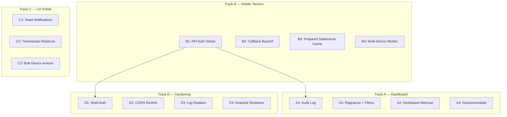

# Plano de Melhorias — Dispatch ADB Framework

> **Data**: 2026-04-06
> **Estado atual**: Fases 1-5,7 APPROVED | Fase 6 READY | Fase 8 BLOCKED
> **Testes**: 276 passando (23 arquivos)
> **Stack**: Node.js 22, TypeScript, Fastify, React 19, SQLite, adbkit

## Visao Geral

Este plano organiza 16 work items em 4 tracks paralelos. Cada item pode
ser executado por um agente independente usando os documentos técnicos de
suporte em `docs/tech/`.

## Grafo de Dependências



## Ordem de Execucao Sugerida

```
Onda 1 (paralelo total — sem dependencias):
  A1, A2, A4, B1, B2, B3, C1, C2, D2, D3, D4

Onda 2 (depende de B1):
  A3, D1

Onda 3 (depende de infra pronta):
  B4, C3
```

---

## Track A — Dashboard (Fase 6)

### A1: Paginacao + Filtros na Fila de Mensagens

**Prioridade**: CRITICA (vai quebrar com volume real ~700 msgs/batch)

**Escopo**:
- Backend: adicionar `offset`, `limit`, `status`, `pluginName`, `dateFrom/dateTo` como query params em `GET /api/v1/messages`
- Frontend: componente de paginacao, filtros de status (chips), busca por numero

**Arquivos a modificar**:
- `packages/core/src/api/messages.ts` — adicionar query params
- `packages/core/src/queue/message-queue.ts` — metodo `listPaginated(filters)`
- `packages/ui/src/components/message-list.tsx` — paginacao + filtros
- `packages/ui/src/App.tsx` — state de paginacao

**Criterios de aceitacao**:
- [ ] GET /messages aceita `?limit=50&offset=0&status=sent&from=2026-04-01`
- [ ] UI mostra 50 msgs por pagina com botoes prev/next
- [ ] Filtro por status via chips (queued/sending/sent/failed)
- [ ] Busca por numero de telefone
- [ ] Counter mostra "1-50 de 347"
- [ ] Testes: listPaginated com filtros

**Docs de suporte**: `docs/tech/api-reference.md`, `docs/tech/sqlite-schema.md`

---

### A2: Dashboard de Metricas

**Prioridade**: ALTA

**Escopo**:
- Cards de metricas: taxa sucesso (%), latencia media, volume/hora
- Graficos: volume por hora (bar chart), sucesso/falha (donut), trend de envios (line)
- Dados vem da tabela `messages` (aggregate queries)

**Arquivos a criar/modificar**:
- `packages/core/src/api/metrics.ts` — NOVO: endpoints de metricas
- `packages/core/src/server.ts` — registrar rotas de metricas
- `packages/ui/src/components/metrics-dashboard.tsx` — NOVO: graficos Recharts
- `packages/ui/src/App.tsx` — nova tab ou secao no dashboard

**Endpoints novos**:
```
GET /api/v1/metrics/summary    — taxa sucesso, latencia media, total hoje
GET /api/v1/metrics/hourly     — volume por hora (ultimas 24h)
GET /api/v1/metrics/by-status  — contagem por status
GET /api/v1/metrics/by-plugin  — contagem por plugin
```

**Criterios de aceitacao**:
- [ ] Summary retorna { successRate, avgLatencyMs, totalToday, totalFailed }
- [ ] Hourly retorna array de 24 objetos { hour, sent, failed, queued }
- [ ] UI mostra bar chart de volume/hora (Recharts BarChart)
- [ ] UI mostra donut de sucesso/falha (Recharts PieChart)
- [ ] Dados atualizam via polling (30s) ou Socket.IO
- [ ] Testes: queries de metricas

**Docs de suporte**: `docs/tech/sqlite-schema.md`, `docs/tech/ui-patterns.md`

---

### A3: Audit Log (Historico Completo)

**Prioridade**: MEDIA (depende de B1 para auth)

**Escopo**:
- Viewer de `message_history` + `messages` combinados
- Busca por numero, data, status, direction, plugin
- Timeline visual de uma mensagem (queued → sending → sent → ack → read)

**Arquivos a criar/modificar**:
- `packages/core/src/api/audit.ts` — NOVO: endpoints de auditoria
- `packages/ui/src/components/audit-log.tsx` — NOVO: tabela + timeline
- `packages/ui/src/App.tsx` — nova tab "Auditoria" no sidebar

**Endpoints novos**:
```
GET /api/v1/audit/messages     — historico completo com filtros
GET /api/v1/audit/messages/:id — timeline de uma mensagem
```

**Criterios de aceitacao**:
- [ ] Lista combinada messages + message_history com paginacao
- [ ] Busca por numero (from/to), data range, status, plugin
- [ ] Timeline mostra: enqueued → sent → waha_captured → ack → read
- [ ] Exportar como CSV (botao)
- [ ] Testes: queries de auditoria

---

### A4: Responsividade

**Prioridade**: MEDIA

**Escopo**:
- Sidebar colapsa para icones em telas < 1024px (ja implementado parcialmente)
- Stats bar empilha em 2x2 em mobile
- Device detail em coluna unica em mobile
- Terminal e Live Screen empilham verticalmente

**Arquivos a modificar**:
- `packages/ui/src/components/sidebar.tsx` — menu hamburger em mobile
- `packages/ui/src/App.tsx` — breakpoints
- `packages/ui/src/components/device-detail.tsx` — grid responsivo

**Criterios de aceitacao**:
- [ ] Layout funcional em 360px width (mobile)
- [ ] Sidebar vira bottom nav ou hamburger em < 768px
- [ ] Graficos redimensionam corretamente
- [ ] Touch-friendly: botoes min 44px

---

## Track B — Debito Tecnico

### B1: API Auth Global

**Prioridade**: CRITICA (seguranca)

**Escopo**:
- Middleware Fastify que valida `X-API-Key` header em todas as rotas
- Exceções: `GET /health`, `POST /webhooks/waha` (tem HMAC proprio)
- Key configurada via `DISPATCH_API_KEY` env var

**Arquivos a modificar**:
- `packages/core/src/server.ts` — adicionar hook `onRequest`
- `packages/ui/src/config.ts` — adicionar API key header nos fetches
- `packages/ui/src/App.tsx` — passar API key nos requests

**Criterios de aceitacao**:
- [ ] Requests sem X-API-Key retornam 401
- [ ] /health e /webhooks/waha sao publicos
- [ ] UI envia API key automaticamente
- [ ] Testes: middleware rejeita sem key, aceita com key

---

### B2: Callback Backoff

**Prioridade**: ALTA

**Escopo**: Callbacks hoje retentam imediatamente. Implementar delays: 5s, 15s, 45s.

**Arquivos a modificar**:
- `packages/core/src/plugins/callback-delivery.ts` — adicionar delay entre retries

**Criterios de aceitacao**:
- [ ] Retry 1: imediato, Retry 2: 5s, Retry 3: 15s
- [ ] Timeout total max: ~65s
- [ ] Teste: verifica delays entre retries

---

### B3: Prepared Statements Cache

**Prioridade**: MEDIA

**Escopo**: Mover `db.prepare()` para propriedades da classe em PluginRegistry, CallbackDelivery, e MessageQueue.getQueueStats.

**Arquivos a modificar**:
- `packages/core/src/plugins/plugin-registry.ts`
- `packages/core/src/plugins/callback-delivery.ts`

**Criterios de aceitacao**:
- [ ] Nenhum `db.prepare()` dentro de metodos (exceto initialize)
- [ ] Statements cacheados como propriedades lazy ou no constructor
- [ ] Testes continuam passando (276)

---

### B4: Multi-Device Worker

**Prioridade**: ALTA (necessario para 2+ devices)

**Escopo**: Worker loop atual pega o primeiro device online. Deve distribuir round-robin ponderado por health score.

**Arquivos a modificar**:
- `packages/core/src/server.ts` — worker loop
- `packages/core/src/engine/dispatcher.ts` — logica de distribuicao

**Criterios de aceitacao**:
- [ ] Com 2 devices online, mensagens distribuem entre ambos
- [ ] Device com ban ativo e pulado
- [ ] Device com bateria < 15% e deprioritizado
- [ ] Testes: dispatcher com multiplos devices

---

## Track C — UX Polish

### C1: Toast Notifications

**Prioridade**: MEDIA

**Escopo**: Feedback visual quando mensagem envia/falha/alerta novo.

**Arquivos a criar/modificar**:
- `packages/ui/src/components/toast.tsx` — NOVO: componente de toast
- `packages/ui/src/App.tsx` — listener de eventos para toasts

**Criterios de aceitacao**:
- [ ] Toast verde quando message:sent
- [ ] Toast vermelho quando message:failed
- [ ] Toast amarelo quando alert:new
- [ ] Auto-dismiss apos 5s
- [ ] Empilhaveis (max 3 visiveis)

---

### C2: Timestamps Relativos

**Prioridade**: BAIXA

**Escopo**: Trocar timestamps absolutos por relativos ("ha 2 min") em toda a UI.

**Arquivos a modificar**:
- `packages/ui/src/components/message-list.tsx`
- `packages/ui/src/components/alert-panel.tsx`
- `packages/ui/src/components/session-manager.tsx`

**Criterios de aceitacao**:
- [ ] "ha X min/h/d" para < 24h
- [ ] Data completa para > 24h
- [ ] Atualiza a cada 30s (sem re-fetch)

---

### C3: Bulk Device Actions

**Prioridade**: MEDIA

**Escopo**: Selecionar multiplos devices, aplicar acoes em batch.

**Arquivos a criar/modificar**:
- `packages/core/src/api/devices.ts` — endpoint `POST /devices/bulk-action`
- `packages/ui/src/components/device-grid.tsx` — checkbox de selecao

**Criterios de aceitacao**:
- [ ] Checkbox em cada device card
- [ ] Botoes: "Keep Awake All", "Screenshot All", "Reboot All" (com confirmar)
- [ ] Resultado mostra sucesso/falha por device

---

## Track D — Hardening

### D1: Shell Endpoint Auth

**Prioridade**: CRITICA (depende de B1)

**Escopo**: POST /devices/:serial/shell é perigoso sem auth. Apos B1, garantir que está protegido.

**Criterios de aceitacao**:
- [ ] Shell endpoint requer X-API-Key (coberto por B1)
- [ ] Adicionar rate limit: max 10 req/min por IP
- [ ] Log de auditoria: cada comando executado

---

### D2: CORS Restrito

**Prioridade**: ALTA

**Escopo**: Trocar `origin: '*'` por lista de origens permitidas.

**Arquivos a modificar**:
- `packages/core/src/server.ts` — CORS config

**Criterios de aceitacao**:
- [ ] CORS aceita: localhost:5173, localhost:7890, DISPATCH_ALLOWED_ORIGINS env
- [ ] Requests de outros origins bloqueados
- [ ] Electron funciona (mesmo host)

---

### D3: Log Rotation

**Prioridade**: MEDIA

**Escopo**: Adicionar pino-roll para rotacionar logs (50MB, 5 backups).

**Arquivos a modificar**:
- `packages/core/src/server.ts` — pino transport
- `packages/core/package.json` — adicionar pino-roll

**Criterios de aceitacao**:
- [ ] Logs rotacionam ao atingir 50MB
- [ ] Mantém 5 backups
- [ ] Funciona em dev (pino-pretty) e prod (pino-roll)

---

### D4: Graceful Shutdown Completo

**Prioridade**: MEDIA

**Escopo**: Expandir o shutdown atual para drain da fila e cleanup completo.

**Arquivos a modificar**:
- `packages/core/src/main.ts`
- `packages/core/src/server.ts` — onClose hook

**Criterios de aceitacao**:
- [ ] Ctrl+C espera mensagem em envio terminar (max 60s)
- [ ] Limpa stale locks antes de fechar
- [ ] Fecha conexoes SQLite, Socket.IO, ADB
- [ ] Log "Shutdown complete" no final

---

## Documentos de Suporte para Agentes

Os agentes devem ler estes documentos antes de executar qualquer work item:

| Documento | Conteúdo | Quando usar |
|-----------|----------|-------------|
| `docs/tech/sqlite-schema.md` | Todas as tabelas com colunas e indices | Backend (queries, migrações) |
| `docs/tech/api-reference.md` | Todos os endpoints com request/response | Backend + Frontend |
| `docs/tech/ui-patterns.md` | Padroes de componentes React, imports, styling | Frontend |
| `docs/tech/conventions.md` | Naming, testing, git, logging, error handling | Todos |
| `.dev-state/progress.md` | Estado atual do desenvolvimento | Contexto recovery |
| `CLAUDE.md` | Protocolo completo de desenvolvimento | Sempre |

---

## Metricas de Sucesso

Ao completar todos os 16 items:
- **276+ testes** passando (adicionar ~40 novos)
- **0 endpoints** sem autenticacao (exceto health/webhook)
- **Paginacao** funcionando para 1000+ mensagens
- **Dashboard** com graficos de metricas em tempo real
- **Multi-device** distribuindo mensagens entre 2+ devices
- **Audit log** com historico completo e busca
